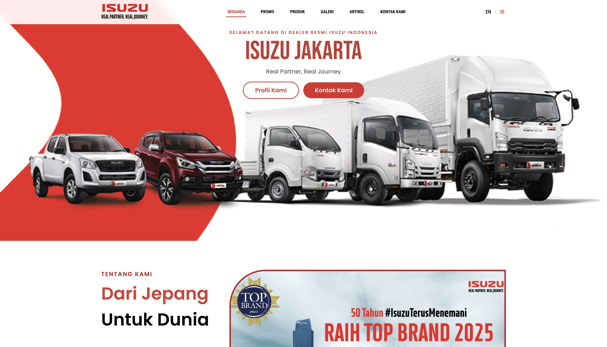
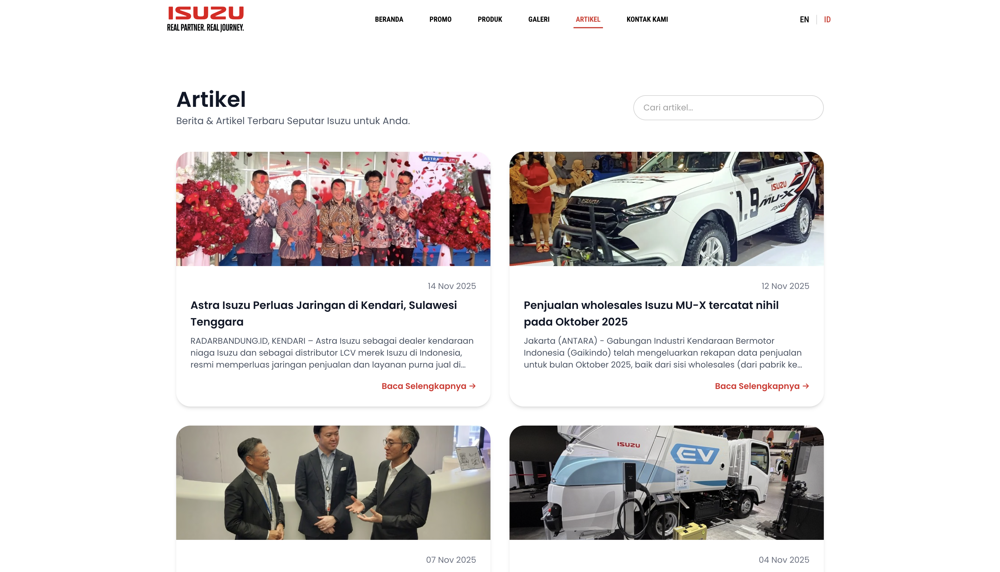

# 🚗 Isuzu Karabha – MarketingWeb Application for Marketing

---

## ✨ Fitur Utama

### 🔹 Halaman Publik
- Beranda (Hero, CTA, highlight promo)
- Promo (list promo + detail promo)
- Artikel (list artikel + detail artikel)
- Gallery foto unit
- Contact / Hubungi Kami

### 🔹 Halaman Admin
- Login admin (opsional)
- CRUD Promo
- CRUD Artikel
- CRUD Gallery
- Upload gambar (Laravel Storage)
- Validasi form
- Slug otomatis (opsional)

---

## 🛠 Teknologi
- Laravel 10+
- MySQL / MariaDB
- Blade Template
- TailwindCSS / Bootstrap (sesuai project)
- Laravel Storage (public disk)
- Git & GitHub

---

## 📦 Instalasi Project

### 1️⃣ Clone Repository
```bash
git clone https://github.com/username/isuzu-karabha.git
cd isuzu-karabha
```
### 2️⃣ Install Dependensi
```bash
composer install
npm install
```
### 3️⃣ Salin File ENV
```bash
Copy code
cp .env.example .env
```
Lalu atur bagian database:
```bash
makefile
Copy code
DB_DATABASE=isuzu
DB_USERNAME=root
DB_PASSWORD=
```
### 4️⃣ Generate Key
```bash
php artisan key:generate
```
### 5️⃣ Migrasi Database
```bash
php artisan migrate
```
### 6️⃣ Link Storage
```bash
php artisan storage:link
```
### 7️⃣ Jalankan Server
```bash
php artisan serve
```
📂 Struktur Folder Penting
```bash
/app
  /Http/Controllers
  /Models
/resources
  /views
    /layouts
    /promo
    /artikel
    /gallery
/public
/routes
  web.php
```
📸 Screenshots (Opsional)
Simpan screenshot ke folder /public/screenshots/ lalu masukkan seperti ini:
```



```
